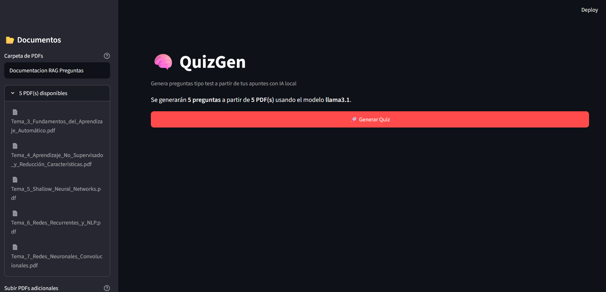
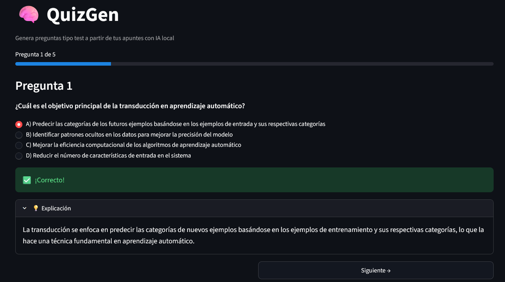
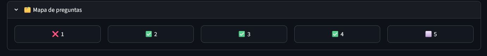
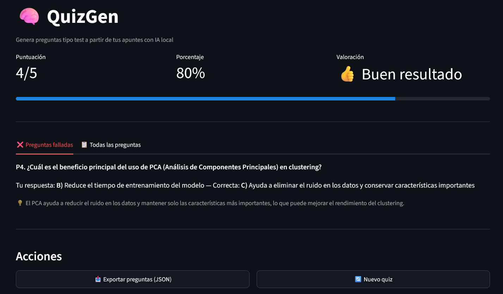

# QuizGen Web — Ampliación Streamlit

## Qué es

`quizgen_web.py` es la versión con interfaz web del generador de preguntas QuizGen. No sustituye al script original (`quizgen.py`), lo **importa y reutiliza**. Toda la lógica de RAG (indexación, embeddings, generación de preguntas) sigue ejecutándose exactamente igual; lo único que cambia es la capa de presentación: de terminal interactiva a aplicación web con Streamlit.

## Cómo ejecutarlo

```bash
# Asegúrate de que Ollama está corriendo
ollama serve

# Instala la dependencia adicional (si no la tienes)
python -m pip install streamlit

# Arranca la interfaz web
python -m streamlit run quizgen_web.py
```

El script original sigue funcionando igual que siempre:
```bash
python quizgen.py --num 5
```

Ambos comparten el mismo índice FAISS en disco (`quizgen_vectorstore_*/`), los mismos PDFs y los mismos modelos de Ollama.

## Capturas de pantalla

### Pantalla de configuración

La sidebar gestiona documentos (subir PDFs, ver indexados) y ajustes del modelo. El área principal muestra un resumen antes de generar.



### Quiz interactivo

Una pregunta por pantalla con barra de progreso. Tras confirmar la respuesta se muestra feedback inmediato (correcto/incorrecto) y la explicación generada por el LLM.



### Mapa de preguntas

Permite navegar libremente entre preguntas ya respondidas. Los iconos indican acierto (✅), fallo (❌) o sin responder (⬜).



### Pantalla de resultados

KPIs de puntuación con dos pestañas: una para repasar los fallos y otra con el listado completo. Incluye exportación a JSON.



## Estructura de ficheros tras la ampliación

```
quizgen-ollama/
├── quizgen.py                      # Script original (sin modificar)
├── quizgen_web.py                  # NUEVO — Interfaz Streamlit
├── requirements.txt                # Actualizado (añadido: streamlit)
├── QUIZGEN_WEB.md                  # NUEVO — Esta documentación
├── CLAUDE.md
├── README.md
├── ejemplo_ejecucion.txt
├── docs/                           # NUEVO — Capturas de la interfaz web
│   ├── web_configurar.png
│   ├── web_quiz.png
│   ├── web_mapa.png
│   └── web_resultados.png
├── Documentacion RAG Preguntas/    # PDFs de ejemplo
│   └── *.pdf
└── .gitignore
```

## Decisiones de diseño

### ¿Por qué importar quizgen.py en vez de copiar el código?

El ejercicio pide demostrar entendimiento del código original. La forma más clara de hacerlo es **no tocarlo**: si la versión web funciona importando directamente `cargar_o_crear_indice()` y `generar_preguntas()`, es porque esas funciones ya estaban bien diseñadas, son modulares y no dependen de la terminal.

Lo que importamos:
- `cargar_o_crear_indice(carpeta_pdfs, carpeta_indice)` — Pipeline completo de PDF → chunks → embeddings → FAISS
- `generar_preguntas(vectorstore, num, modelo)` — RAG + LLM → preguntas validadas en JSON
- `exportar_preguntas(preguntas, ruta)` — Serialización a JSON (aunque en la web usamos `st.download_button`)
- Las constantes de configuración (`CARPETA_PDFS`, `MODELO_LLM`, etc.)

Lo que NO importamos (porque es específico de terminal):
- `ejecutar_quiz()` — Lee `input()` del teclado, no tiene sentido en web
- `main()` — Parsea `argparse`, que tampoco aplica en Streamlit

### ¿Por qué una pregunta por pantalla y no todas a la vez?

Tres razones:

1. **UX de examen real**: en un test real no ves todas las preguntas simultáneamente. Una por pantalla obliga a comprometerse con la respuesta antes de avanzar.

2. **Rendimiento de Streamlit**: si pones 20 `st.radio` en la misma página, cada click en cualquiera de ellos re-ejecuta el script completo. Con una sola pregunta visible, el rerun es instantáneo.

3. **Feedback inmediato**: tras confirmar, se muestra si has acertado y la explicación del LLM. Esto permite aprender pregunta a pregunta, no solo al final.

### ¿Por qué el "mapa de preguntas"?

Permite navegar libremente entre preguntas ya respondidas (para revisar), con indicadores visuales de acierto/fallo. Es una mejora respecto a la versión terminal, donde las preguntas son estrictamente secuenciales y no puedes volver atrás.

### ¿Por qué session_state con una "fase"?

El quiz tiene un flujo lineal de tres pasos: configurar → quiz → resultados. Streamlit no tiene concepto de "páginas" dentro de un mismo script (salvo MPA), así que la forma estándar es usar una variable de estado (`st.session_state.fase`) como máquina de estados que decide qué se renderiza en cada rerun.

Alternativas descartadas:
- **MPA (Multi-Page App)**: overkill para tres vistas, y complicaría compartir el estado del quiz entre páginas.
- **Tabs**: no encaja porque las fases son secuenciales (no tiene sentido ver "resultados" antes de hacer el quiz).
- **Todo en una página**: demasiado largo, el usuario se pierde haciendo scroll.

## Conexión con los ejemplos del profesor

| Patrón usado | Ejemplo del profesor | Dónde se aplica |
|---|---|---|
| `st.session_state` para persistencia entre reruns | `s4_streamlit_estado.py` | Estado del quiz (preguntas, respuestas, fase actual) |
| Sidebar con gestión documental | `s13_streamlit_rag_ollama.py` | Subida de PDFs, lista de documentos indexados, configuración |
| `st.file_uploader` + procesamiento | `s13_streamlit_rag_ollama.py` | Subida de PDFs que se guardan en disco para PyPDFLoader |
| `st.metric` en columnas para KPIs | `s1_streamlit_escritura.py` | Pantalla de resultados (puntuación, porcentaje, valoración) |
| `st.tabs` para organizar contenido | `s9_streamlit_navegacion_tab.py` | Resultados: tab de fallos vs tab de todas las preguntas |
| `st.progress` como barra visual | — | Progreso del quiz (pregunta N de M) y barra de puntuación |
| `st.expander` para contenido secundario | `s5_streamlit_layout.py` | Explicación del LLM tras responder, lista de PDFs, mapa de preguntas |
| `st.spinner` durante operaciones lentas | `s13_streamlit_rag_ollama.py` | Indexación de PDFs y generación de preguntas |
| `st.download_button` para exportación | — | Descargar preguntas como JSON |
| `st.rerun()` para forzar actualización | `s6_streamlit_mpa_inicio.py` | Transiciones entre fases (configurar → quiz → resultados) |

## Diferencias entre la versión terminal y la versión web

| Aspecto | `quizgen.py` (terminal) | `quizgen_web.py` (Streamlit) |
|---|---|---|
| Subida de PDFs | Solo carpeta local (argumento `--carpeta`) | Carpeta local + drag & drop desde el navegador |
| Selección de modelo | Argumento `--modelo` | Campo de texto en sidebar |
| Número de preguntas | Argumento `--num` | Slider en sidebar |
| Quiz | Secuencial, sin vuelta atrás | Navegación libre con mapa de preguntas |
| Feedback | Tras cada respuesta (texto) | Tras cada respuesta (visual: colores + expander) |
| Resultados | Puntuación final en texto | KPIs + tabs de revisión (fallos / todas) |
| Exportar | `--exportar quiz.json` (disco) | Botón de descarga (navegador) |
| Reindexar | `--reindexar` (flag CLI) | Botón en sidebar |
| Índice FAISS | Compartido en disco | El mismo directorio, compartido con terminal |
